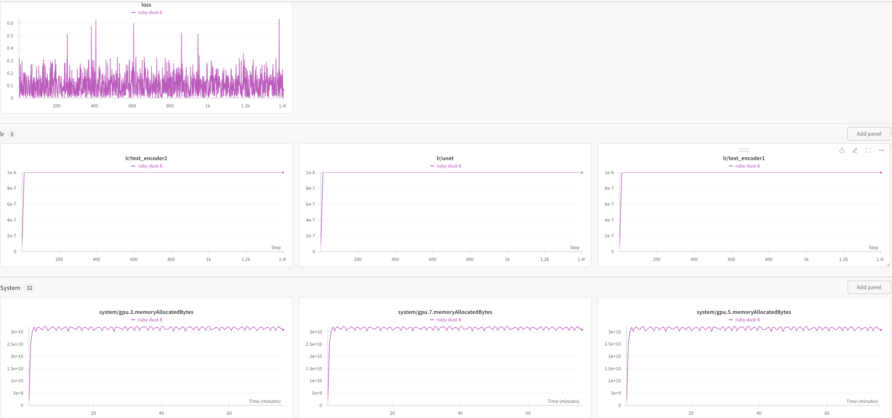

# Taiyi Diffusion XL


## 开发环境和下载模型
```
git clone https://github.com/IDEA-CCNL/Taiyi-Diffusion-XL.git
pip install -r requirements.txt
```
模型下载地址是https://huggingface.co/IDEA-CCNL/Taiyi-Stable-Diffusion-XL-3.5B

## 准备数据
提取图像的latent为训练作准备，格式化输入json：
```
sh scripts/prepare_latent_buckets/cat-woman.sh 
```
原始训练数据放在./data/catwoman_data目录下一共23张图，然后生成的latnet在./data/catwoman_data_latent_1024上

## 开始训练
```
sh scripts/finetune_model_TaiyiXL_data_catwoman.sh
```
训练100个epoch每个epoch末端我们都会测试一下case“一位美丽的猫女，金色的头发和蓝色的眼睛”.可以看到最初我们的模型还不是很理解“猫女”的概念，50个epoch之后就比较认识了，而最终模型的生成效果非常好了
| Epoch | Generated Images |
|-------|-----------------|
| Epoch 1 |  |
| Epoch 2 |  |
| Epoch 3 |  |
| Epoch 10 |  |
| Epoch 20 |  |
| Epoch 50 |  |
| Epoch 80 |  |
| Epoch 98 |  |
| Epoch 99 |  |
| Epoch 100 |  |

大概训练了75分钟，一般可以少跑点epochs


## 推理
```
python taiyi_xl_minimal_inference.py
```
最后我们来推理下我们的模型，给猫女换个头发颜色和眼睛颜色，"一个美丽的猫女，有着黄色眼睛和黑色头发"

试试给猫女穿上汉服："一个身穿汉服的美丽的猫女，有着黄色眼睛和黑色头发，简单妆容，眼罩和摩托车"

可以看出模型泛化效果也还是不错的。

## Credits

本代码参考自kohya和huggingface diffusers
- https://github.com/kohya-ss/sd-scripts
- https://github.com/Linaqruf/kohya-trainer
- https://github.com/huggingface/diffusers

## 引用 Citation

如果您在您的工作中使用了我们的模型，可以引用我们的论文：

If you are using the resource for your work, please cite the our paper:
```text
@misc{wu2024taiyidiffusionxl,
      title={Taiyi-Diffusion-XL: Advancing Bilingual Text-to-Image Generation with Large Vision-Language Model Support}, 
      author={Xiaojun Wu and Dixiang Zhang and Ruyi Gan and Junyu Lu and Ziwei Wu and Renliang Sun and Jiaxing Zhang and Pingjian Zhang and Yan Song},
      year={2024},
      eprint={2401.14688},
      archivePrefix={arXiv},
      primaryClass={cs.CL}
}
```

```text
@article{fengshenbang,
  author    = {Jiaxing Zhang and Ruyi Gan and Junjie Wang and Yuxiang Zhang and Lin Zhang and Ping Yang and Xinyu Gao and Ziwei Wu and Xiaoqun Dong and Junqing He and Jianheng Zhuo and Qi Yang and Yongfeng Huang and Xiayu Li and Yanghan Wu and Junyu Lu and Xinyu Zhu and Weifeng Chen and Ting Han and Kunhao Pan and Rui Wang and Hao Wang and Xiaojun Wu and Zhongshen Zeng and Chongpei Chen},
  title     = {Fengshenbang 1.0: Being the Foundation of Chinese Cognitive Intelligence},
  journal   = {CoRR},
  volume    = {abs/2209.02970},
  year      = {2022}
}
```
